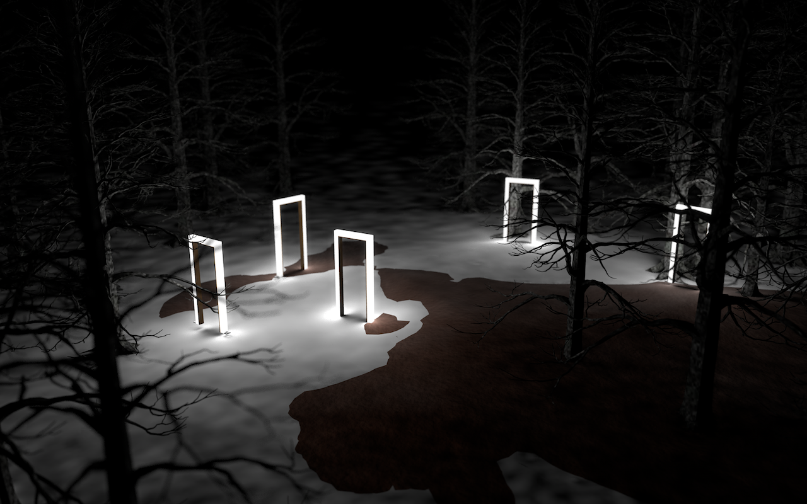
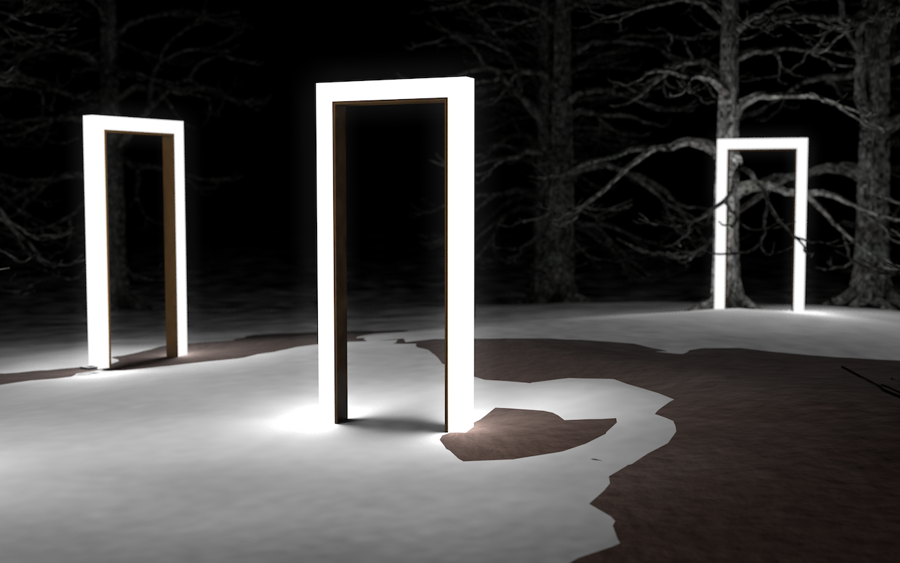
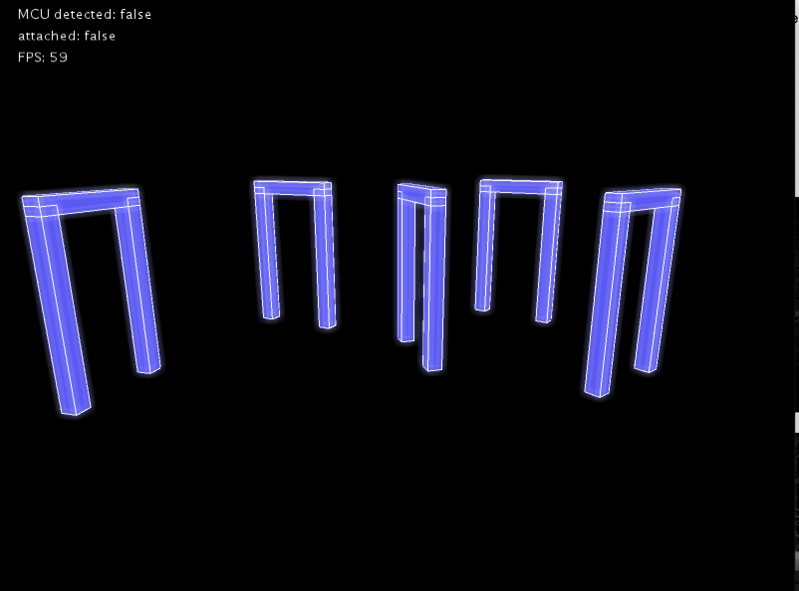
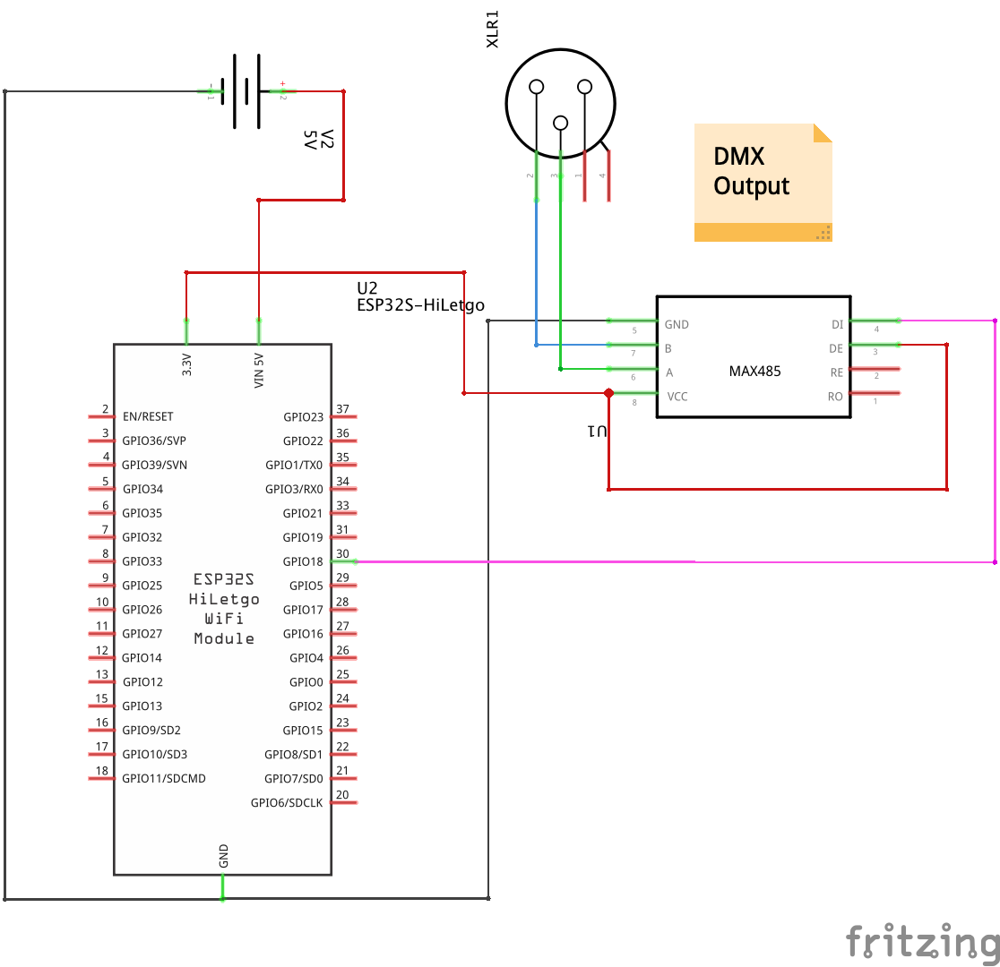
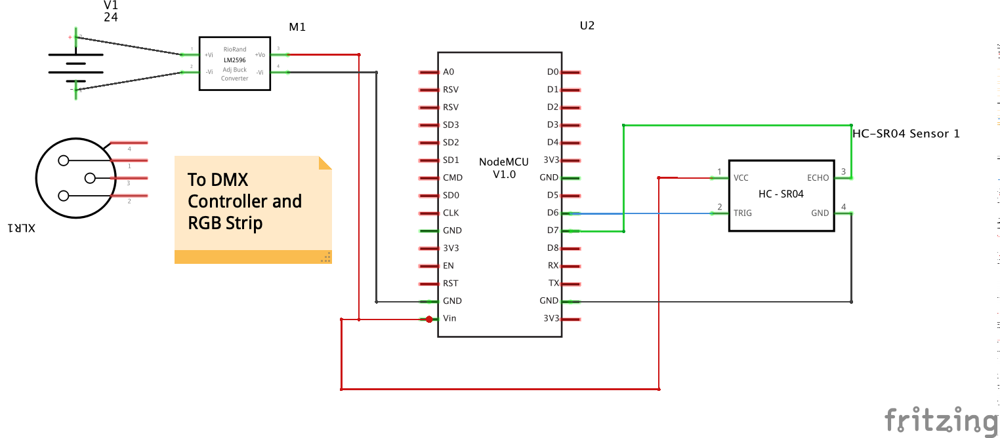

# Light Installation «åben»

The immersive installation «åben» (Danish: open) lets the viewer playfully experience how important collective coexistence is and how easy it is to accomplish a task with it.
Walking through the gates is perceived as the first step towards a common goal. The more people take this first step at the same time, the more pleasant it is to reach it. «åben» is intended to increase visitors' awareness of the importance of understanding living together!

### Documentation

#### Visualiser

#### Motherboard

#### Portal Board
